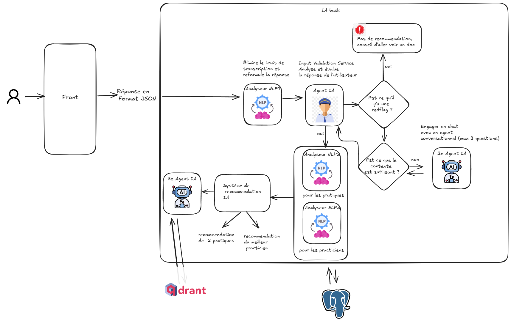

# 🧠 **Holistic AI - Conseiller Bien-être**

Une application web intelligente et complète, **Holistic AI** est conçue pour fournir des recommandations de bien-être holistique hautement personnalisées. En analysant les besoins de l'utilisateur via un texte libre ou un questionnaire adaptatif, l'application identifie la pratique la plus pertinente et génère des conseils détaillés grâce à un agent **RAG** avancé, connecté à une base de connaissances vectorielle. Le système intègre également une **authentification utilisateur** et un mécanisme d'**apprentissage continu** basé sur le feedback.




---

### ✨ **Fonctionnalités Clés**

Cette version représente une application mature et prête pour la production, incluant :

#### 🎨 **Interface Moderne et Interactive**

Une interface utilisateur épurée, réactive et moderne, construite avec **Tailwind CSS** et **JavaScript** pour garantir une expérience utilisateur fluide et agréable.

#### 🧠 **Double Moteur de Recommandation**

1. **Système Initial basé sur MongoDB et Embeddings** : Ce moteur utilise un matching sémantique et par mots-clés et encore plus (logique fuzzy ..) pour trouver la pratique la plus pertinente pour l'utilisateur.
2. **Système Avancé avec Agent RAG (Qdrant + Gemini + Agno)** : Un agent intelligent qui génère des conseils détaillés, enrichis et contextuels à partir d'une base de données vectorielle.

#### 🔐 **Authentification et Sessions Utilisateur**

Système complet d'inscription et de connexion avec gestion des sessions. Chaque recommandation et feedback est lié à un utilisateur unique, permettant un suivi personnalisé à chaque interaction.

#### 📈 **Apprentissage Continu par Feedback**

Le système apprend des retours des utilisateurs pour ajuster dynamiquement la pertinence des recommandations, en s'améliorant à chaque nouvelle interaction.

#### ⚡ **Haute Performance**

Toutes les ressources lourdes, telles que les modèles **NLP**, les connexions aux bases de données et le retriever **RAG**, sont chargées une seule fois au démarrage de l'application, garantissant des temps de réponse rapides (une amélioration de 3 à 4 fois en termes de vitesse).

#### ❓ **Deux Modes d'Interaction**

1. **Texte Libre** : L'utilisateur décrit ses symptômes dans ses propres mots (avec une longueur minimale de 20 caractères requise).
2. **Questionnaire Adaptatif** : Un questionnaire exhaustif, entièrement personnalisable dans `data/questions.yaml`. L'application pose des questions ciblées et exhaustives pour affiner le diagnostic.

#### ✅ **Tests et Qualité du Code**

- **Tests Automatisés** : Une couverture de tests de 60% avec **Pytest**.
- **Système de Logging** : Un système de **logging centralisé** pour un suivi et un débogage efficaces.
- **Architecture Modulaire** : Une architecture propre avec une séparation claire des responsabilités (routes, services, modèles).

---

### 🛠️ **Stack Technologique**

| **Catégorie**            | **Technologie**                                                                               | **Rôle**                                                                 |
| ------------------------ | --------------------------------------------------------------------------------------------- | ------------------------------------------------------------------------ |
| **Backend**              | FastAPI (Python 3.11)                                                                         | Framework principal pour construire une API asynchrone et performante.   |
| **Frontend**             | HTML5, Tailwind CSS, JS                                                                       | Interface utilisateur moderne et entièrement responsive.                 |
| **Bases de Données**     | MongoDB                                                                                       | Stockage des données des utilisateurs, des sessions et des pratiques.    |
|                          | Qdrant (Vector DB)                                                                            | Base de données vectorielle pour la recherche sémantique de l’agent RAG. |
| **IA & NLP**             | HuggingFace, Spacy, regex, fuzzy logic, Google Gemini, Recommender system with feedback loops | Modèle de langage pour la génération des réponses de l'agent RAG.        |
| **LangChain**            | LangChain                                                                                     | Framework pour orchestrer les composants de l'agent RAG.                 |
| **SentenceTransformers** | SentenceTransformers                                                                          | Modèle pour la génération des embeddings initiaux.                       |
| **spaCy**                | spaCy                                                                                         | Analyse NLP (extraction de mots-clés, symptômes).                        |
| **DevOps**               | Docker & Docker Compose                                                                       | Conteneurisation et orchestration des services de l'application.         |

---

### 📂 **Structure du Projet et Rôle des Fichiers**

Voici une vue d’ensemble de la structure du projet et des fichiers importants :

- **.env** : Variables d’environnement pour les clés secrètes et les adresses des bases de données.
- **Dockerfile** : Recette pour construire l’image Docker du backend FastAPI.
- **docker-compose.yml** : Fichier d’orchestration pour connecter tous les services (backend, frontend, BDD).
- **requirements.txt** : Liste des dépendances Python du projet.
- **pytest.ini** : Configuration pour Pytest.
- **prometheus/prometheus.yml** : Fichier de configuration pour Prometheus, surveillant les métriques.
- **frontend/index.html** : Le fichier contenant la logique de l’interface utilisateur.

#### **app/**

- **main.py** : Point d’entrée de l’application FastAPI, configure les middlewares (CORS), le lifespan et inclut les routeurs.
- **config.py** : Chargement et validation des variables d’environnement dans un objet Pydantic Settings.
- **logging_config.py** : Configuration du logging.
- **monitoring.py** : Définition des métriques personnalisées pour Prometheus.

#### **app/api/routes/**

- **auth.py** : Gestion de l’inscription (/register) et de la connexion (/login).
- **feedback.py** : Gestion de la soumission des feedbacks (/feedback).
- **questionnaire.py** : Fournit les configurations du questionnaire (/config).
- **recommandations.py** : L'endpoint principal pour gérer les recommandations (/recommendations).

#### **app/services/**

- **nlp_analyzer.py** : Service responsable de l'analyse du langage naturel du texte de l'utilisateur.
- **recommender.py** : Service du moteur de recommandation avec MongoDB.
- **rag_agent_service.py** : Service du moteur de recommandation avancé utilisant Qdrant et Gemini.
- **feedback_service.py** : Sauvegarde et gestion du feedback utilisateur.
- **learning_service.py** : Contient la logique d'apprentissage continu pour mettre à jour les scores des pratiques.

#### **app/models/**

- **models.py** : Définit les structures de données avec Pydantic pour garantir la validation des données.

#### **app/utils/**

- **database.py** : Gestion des connexions MongoDB.
- **dependencies.py** : Injection de dépendances pour fournir des instances aux routes.

#### **data/** & **scripts/**

- **data/** : Contient les données statiques.
- **scripts/** : Scripts pour peupler la base de données et gérer les exports (ex. `seed_db.py`).

#### **tests/**

- **conftest.py** : Configuration pour Pytest et la connexion aux bases de données de test.
- **test\_\*.py** : Tests unitaires pour chaque composant du projet.

---

### 🚀 **Guide de Démarrage**

**Configuration Initiale** :

1. Assurez-vous que **Docker** et **Docker Compose** sont installés.
2. Créez un environnement virtuel Python et installez les dépendances avec `pip install -r requirements.txt`.
3. Modifiez le fichier `.env` en fonction des variables nécessaires (clés d'API, URL des bases de données, etc.).

**Lancer l’Écosystème** :

1. Ouvrez un terminal et exécutez :

   ```bash
   docker-compose up mongo mongo-express
   ```

   Cela va construire l'image Docker, démarrer les services MongoDB et Mongo-Express, et peupler la base de données.

2. **Peupler la Base de Données** : Exécutez le script `seed_db.py` dans `app/scripts/seed_db.py` pour ajouter des pratiques à votre base de données MongoDB.

3. **Peupler la Base de Données Vectorielle (Qdrant)** : Utilisez les snapshots dans `app/data/offline_RAG/` pour restaurer la base de données Qdrant de l'agent RAG (comme dans le projet précédent).

4. **Accéder à l’Application** :

   - Backend : `uvicorn app.main:app --reload` assurer vous d'etre dans le meme niveau que le fichier `.env`
   - Frontend : [http://localhost:8080](http://localhost:8080) : lancer avec le serveur python avec cette commande (python -m http.server 8080)
   - Documentation API : [http://localhost:8000/docs](http://localhost:8000/docs)
   - Mongo Express : [http://localhost:8081](http://localhost:8081)

5. **Lancer les Tests** :

   ```bash
   pytest
   ```

---

### 🔮 **Feuille de Route (Version Ultérieur)**

- **Monitoring Complet** : Intégration des métriques avec Grafana pour un tableau de bord en temps réel.
- **Dockerisation Complète & CI/CD** : Mise en place d’un pipeline d'intégration et de déploiement continu.

---


